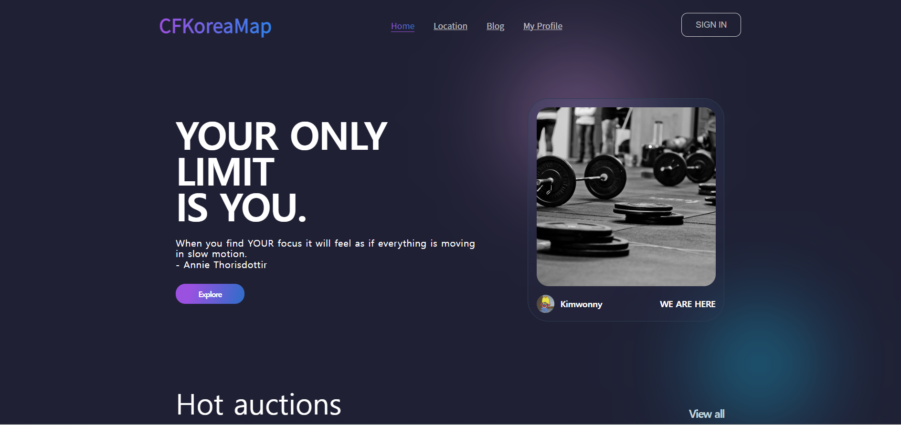

# CFKoreaMap

## ⏰ 일정

- 2023/07/02 ~ (진행중)

##  📄기획 배경

- 한국의 크로스핏 센터의 위치를 한눈에 볼 수 있는 지도를 만들고 해당 사이트에서 바로 블로그를 생성해 관리할 수 있는 웹 사이트

##  📄주요 기능

- 로그인, 회원가입
  - 비밀번호 암호화
  - refresh token, access token 발행
- 지도
  - 검색
  - 클릭시 해당 사이트에서 만들어진 블로그로 이동
- 블로그
  - 공지사항 / 게시글 / 방명록

## 🖥️ 실행 화면

### 메인

### 로그인, 회원가입

### 지도

- Kakao map api 사용, 현 위치 기반 크로스핏 센터 검색 기능
- 전국에서 센터 검색 기능

